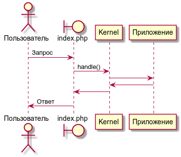
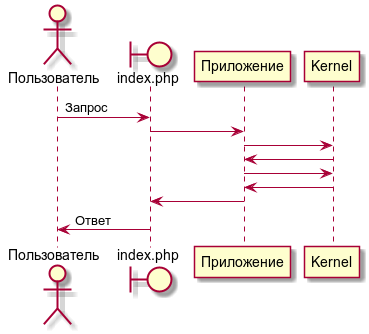

# Ядро (компонент Добро.сайт)

Ядро — узловая точка, связывающая вместе все используемые компоненты. Ядро Добро.сайт рассчитано
на использование в двух режимах: ведущий и ведомый.

## Режим «Ведущий»

Основной режим использования ядра. В этом режиме ядро управляет ходом выполнения приложения. Схема
работы выглядит так:



## Режим «Ведомый»

Режим предназначен для встраивания компонентов Добро.сайт в существующее приложение, например в CMS.
В этом режиме ядро **не** управляет ходом выполнения приложения, а лишь служит точкой доступа к
функциональности компонентов Добро.сайт.



### CMS с единой точкой входа

Предположим требуется встроить ядро в CMS, имеющую единую точку входа — файл `index.php`.  

Создайте два файла:

**dobrosite/Kernel.php**

```php
<?php

use DobroSite\CMS\Kernel\AbstractKernel;

class Kernel extends AbstractKernel
{
}
```

**dobrosite/bootstrap.php**

```php
<?php

require_once dirname(__DIR__).'/vendor/autoload.php';

$GLOBALS['kernel'] = new Kernel('prod', false);

```

**index.php**

```php
<?php

require 'dobrosite/bootstrap.php';

// Исходный код index.php.
```
